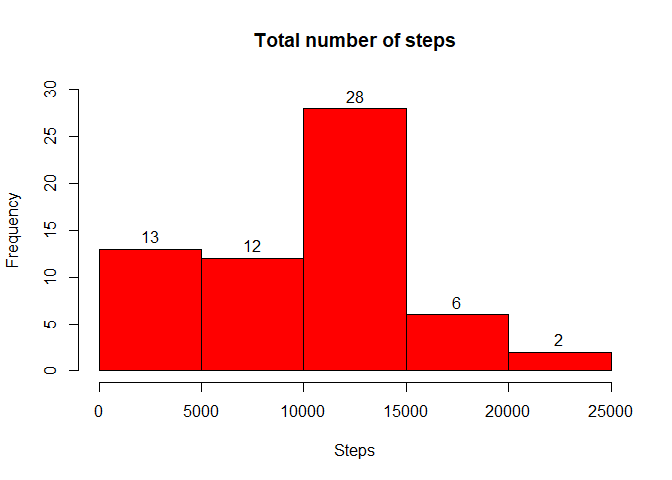
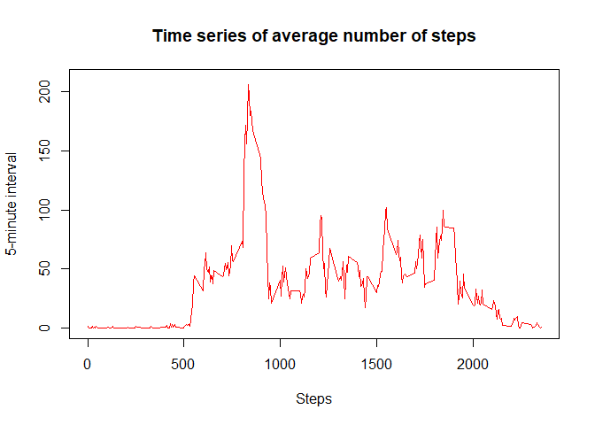
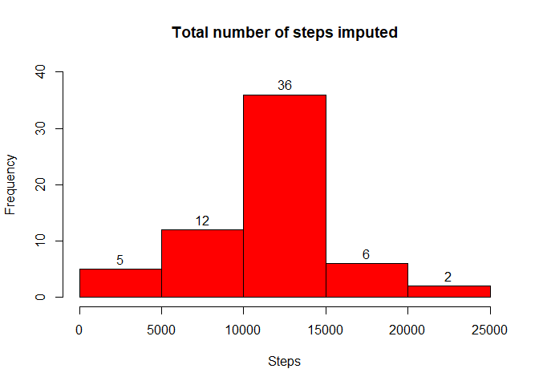
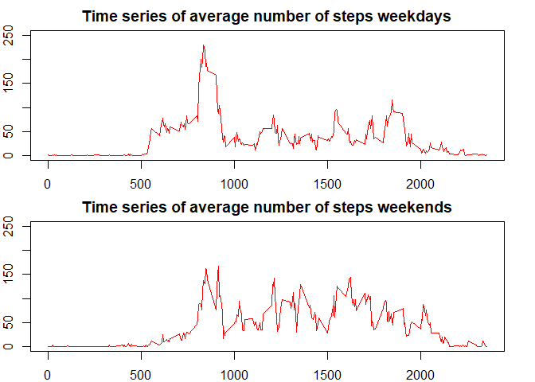

## Loading and preprocessing the data


```r
setwd("~/GitHub/RepData_PeerAssessment1")

# unzip("activity.zip")
proj1 <-read.csv("activity.csv", header = TRUE)
head(proj1)
```

```
##   steps       date interval
## 1    NA 2012-10-01        0
## 2    NA 2012-10-01        5
## 3    NA 2012-10-01       10
## 4    NA 2012-10-01       15
## 5    NA 2012-10-01       20
## 6    NA 2012-10-01       25
```

```r
nrow(proj1)
```

```
## [1] 17568
```

```r
ncol(proj1)
```

```
## [1] 3
```

```r
proj1 <- transform(proj1, date = as.Date(date))
```

## What is mean total number of steps taken per day?

- For this part of the assignment, you can ignore the missing values in the dataset.

**a)** Make a histogram of the total number of steps taken each day


```r
stepxday <- aggregate(proj1["steps"], by=proj1["date"], sum, na.rm = TRUE)
hist(stepxday$steps, xlab = "Steps", col = "red", main = "Total number of steps", ylim = c(0,30), labels = TRUE)
```

<!-- -->

**b)** Calculate and report the mean and median total number of steps taken per day


```r
mean(stepxday$steps)
```

```
## [1] 9354.23
```

```r
median(stepxday$steps)
```

```
## [1] 10395
```
The mean of steps taken per day is 9354.23 and the median is 10395.


## What is the average daily activity pattern?

**a)** Make a time series plot (i.e. type = "l") of the 5-minute interval (x-axis) and the average number of steps taken, averaged across all days (y-axis)


```r
stepxdayMean <- aggregate(proj1["steps"], by=proj1["interval"], mean, na.rm = TRUE)

plot(stepxdayMean$interval, stepxdayMean$steps, xlab = "Steps",  ylab = "5-minute interval", type = "l", col = "red", main = "Time series of average number of steps", ylim = c(0,210))
```

<!-- -->


**b)** Which 5-minute interval, on average across all the days in the dataset, contains the maximum number of steps?


```r
library(data.table)
max <- data.table(stepxdayMean)

max[steps==max(max$steps, na.rm = TRUE)][which.max(interval)]
```

```
##    interval    steps
## 1:      835 206.1698
```
The 5-minute interval that contains the maximum number of steps is the 835.


## Imputing missing 

- Note that there are a number of days/intervals where there are missing values (coded as NA). The presence of missing days may introduce bias into some calculations or summaries of the data.

**a)** Calculate and report the total number of missing values in the dataset (i.e. the total number of rows with NAs)


```r
sum(is.na(proj1))
```

```
## [1] 2304
```
There are 2304 NAs in the original dataset.


- Devise a strategy for filling in all of the missing values in the dataset. The strategy does not need to be sophisticated. For example, you could use the mean/median for that day, or the mean for that 5-minute interval, etc.

**a)** Create a new dataset that is equal to the original dataset but with the missing data filled in.


I imputed with the mean of steps per 5-minutes interval


```r
proj1NA <- proj1 

for (i in 1:length(proj1NA$steps)) {
  if (is.na(proj1NA$steps[i])) {
    proj1NA$steps[i] <- stepxdayMean$steps[stepxdayMean$interval == proj1NA$interval[i]]
  }
}

sum(is.na(proj1NA))
```

```
## [1] 0
```

**b)** Make a histogram of the total number of steps taken each day 


```r
proj1NAMean <- aggregate(proj1NA["steps"], by=proj1NA["date"], sum)
hist(proj1NAMean$steps, xlab = "Steps", col = "red", main = "Total number of steps imputed", ylim = c(0,40), labels = TRUE)
```

<!-- -->

**c)** Calculate and report the mean and median total number of steps taken per day


```r
mean(proj1NAMean$steps)
```

```
## [1] 10766.19
```

```r
median(proj1NAMean$steps)
```

```
## [1] 10766.19
```
After imputation, the mean of steps taken per day is 10766.19 and the median is 10766.19.

**d)** Do these values differ from the estimates from the first part of the assignment? What is the impact of imputing missing data on the estimates of the total daily number of steps?

The mean and median differ from the data that contains NA, the new mean and median are higher. The frequency of the total daily number of steps decreases for the interval between 0 and 1000 steps, but increases for the interval between 10000 and 15000, as shown in the histogram.


## Are there differences in activity patterns between weekdays and weekends?
- For this part the weekdays() function may be of some help here. Use the dataset with the filled-in missing values for this part.

**a)** Create a new factor variable in the dataset with two levels -- "weekday" and "weekend" indicating whether a given date is a weekday or weekend day.


```r
library(dplyr)
```

```
## 
## Attaching package: 'dplyr'
```

```
## The following objects are masked from 'package:data.table':
## 
##     between, first, last
```

```
## The following objects are masked from 'package:stats':
## 
##     filter, lag
```

```
## The following objects are masked from 'package:base':
## 
##     intersect, setdiff, setequal, union
```

```r
library(lubridate)
```

```
## 
## Attaching package: 'lubridate'
```

```
## The following objects are masked from 'package:data.table':
## 
##     hour, isoweek, mday, minute, month, quarter, second, wday, week,
##     yday, year
```

```
## The following objects are masked from 'package:base':
## 
##     date, intersect, setdiff, union
```

```r
proj1W <- proj1NA 
proj1W$weekday <- weekdays(proj1W$date) 

head(proj1W)
```

```
##       steps       date interval weekday
## 1 1.7169811 2012-10-01        0  Monday
## 2 0.3396226 2012-10-01        5  Monday
## 3 0.1320755 2012-10-01       10  Monday
## 4 0.1509434 2012-10-01       15  Monday
## 5 0.0754717 2012-10-01       20  Monday
## 6 2.0943396 2012-10-01       25  Monday
```

```r
 proj1Weekdays <-  proj1W %>%
 select(steps, date, interval, weekday) %>%
 mutate(weekday = wday(date, label=TRUE)) %>%
  filter(!wday(date) %in% c(1, 7))
  
proj1Weekends <-  proj1W %>%
 select(steps, date, interval, weekday) %>%
 mutate(weekday = wday(date, label=TRUE)) %>%
  filter(wday(date) %in% c(1, 7))

head(proj1Weekdays)
```

```
##       steps       date interval weekday
## 1 1.7169811 2012-10-01        0     Mon
## 2 0.3396226 2012-10-01        5     Mon
## 3 0.1320755 2012-10-01       10     Mon
## 4 0.1509434 2012-10-01       15     Mon
## 5 0.0754717 2012-10-01       20     Mon
## 6 2.0943396 2012-10-01       25     Mon
```

```r
head(proj1Weekends)
```

```
##   steps       date interval weekday
## 1     0 2012-10-06        0     Sat
## 2     0 2012-10-06        5     Sat
## 3     0 2012-10-06       10     Sat
## 4     0 2012-10-06       15     Sat
## 5     0 2012-10-06       20     Sat
## 6     0 2012-10-06       25     Sat
```

**b)** Make a panel plot containing a time series plot (i.e. type = "l") of the 5-minute interval (x-axis) and the average number of steps taken, averaged across all weekday days or weekend days (y-axis). The plot should look something like the following, which was created using simulated data:


```r
stepxdayMeanW1 <- aggregate(proj1Weekdays["steps"], by=proj1Weekdays["interval"], mean, na.rm = TRUE)

stepxdayMeanW2 <- aggregate(proj1Weekends["steps"], by=proj1Weekends["interval"], mean, na.rm = TRUE)
```

```r
par(mfrow = c(2, 1))
par(mar = c(2, 2, 2, 2))
plot(stepxdayMeanW1$interval, stepxdayMeanW1$steps, xlab = "Steps",  ylab = "5-minute interval", type = "l", col = "red", main = "Time series of average number of steps weekdays", ylim = c(0,250))

plot(stepxdayMeanW2$interval, stepxdayMeanW2$steps, xlab = "Steps",  ylab = "5-minute interval", type = "l", col = "red", main = "Time series of average number of steps weekends", ylim = c(0,250))
```



